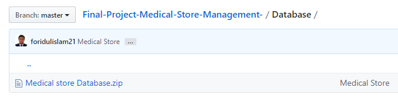
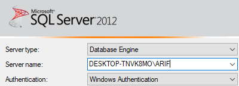
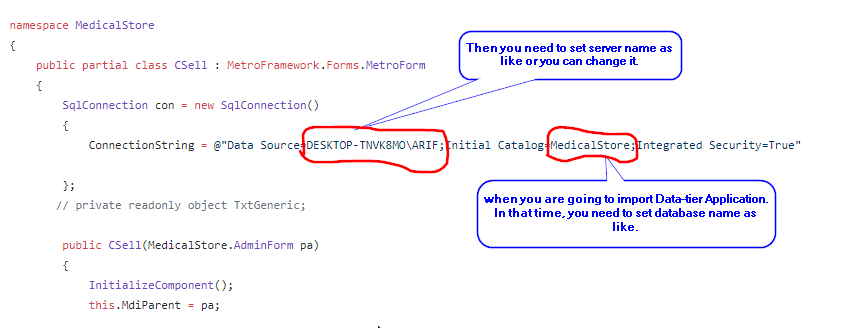
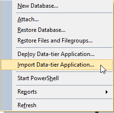
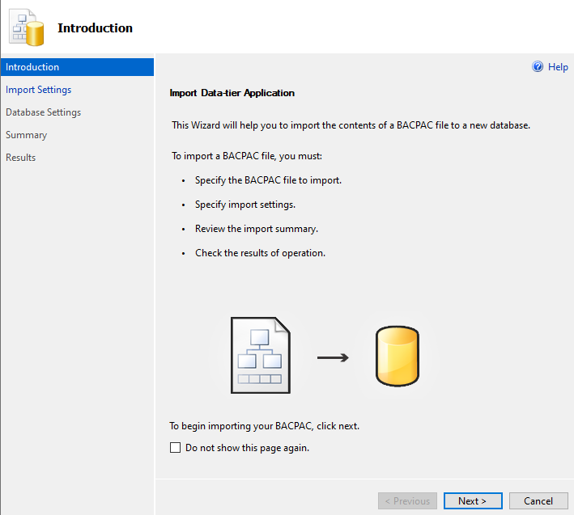
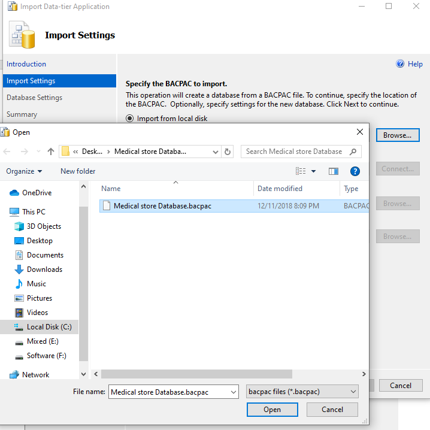
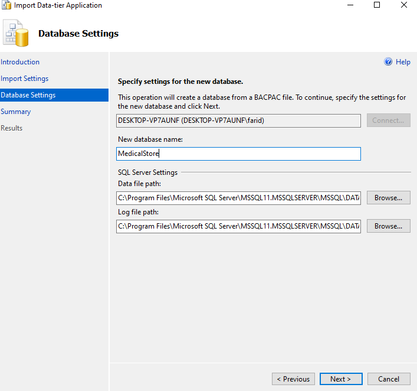
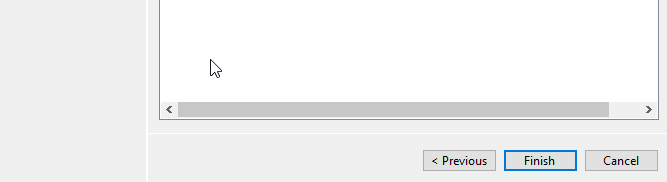
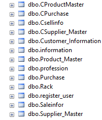
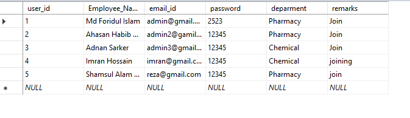

# At first, you need to upzip this database file.

# Set your server name as like if you want to avoid a lot of connection string changes in this project. 

# Double check your database and server name.

# You need to Import database backup file.

# Click on Next.

# Browse and select backup database.

# Set your new database name as like. Then click next and then finished.

# You will see table as like. And In register table you will see email\_id as a username and password. 

